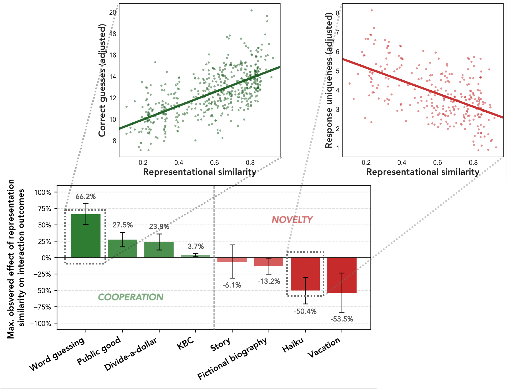

# Representational Similarity and Model Behavior in Multi-Agent Interaction (ICML 2026)

Code and data for *Representational Similarity and Model Behavior in Multi-Agent Interaction* — [arxiv.org/abs/2606.07818](https://arxiv.org/abs/2606.07818).

This repository includes both the code to reproduce the results and the conversation data we generated in the paper. The recorded conversations are under `interaction/conversation_data/`, and the precomputed pairwise CKA matrices are under `rep_sim/`, so the stats scripts (`stats_coop.py` and `stats_novelty.py`) can be re-run without re-running inference.

## Summary

We measure how representational similarity (CKA) between pairs of LLMs relates to their behavior when interacting with each other. Across 8 tasks spanning cooperation games and novelty/creativity, we find that pairs with more similar internal representations:

- **Cooperate better** on cooperative games (word-guessing, public good, divide-a-dollar, KBC),
- **Produce less novel output** on open-ended generation tasks (story writing, fictional biography, haiku, vacation benefit brainstorming).

The figure below shows the maximum observed effect of representation similarity on each task's outcome.



## Setup

1. Copy `.env.example` to `.env` and fill in your `OPENAI_API_KEY` (used to extract numeric responses during cooperative games).
2. Create the conda environment:

```bash
conda env create -f environment.yml
conda activate multi_rep
```

## Directory layout

```
.
├── interaction/
│   ├── divide.py, kbc.py, public_good.py, word_guessing.py   # cooperation games
│   ├── noveltybench.py, single_novelty.py                    # novelty tasks (multi/single agent)
│   ├── conversation_data/                                    # all logged conversation data (jsonl)
│   ├── models/                                               # Model wrapper + model list
│   └── novelty_analysis/                                     # post-processing for novelty tasks
│       ├── partition.py, score.py
│       └── mutual_information.py (+ 4 helpers)
├── representation_similarity_main.py                         # compute pairwise CKA matrices
├── calculate_similarity.py, metrics.py                       # CKA implementation
├── rep_sim/                                                  # output: per-pair CKA data
├── stats_novelty.py, stats_coop.py                           # mixed-effects analyses
└── results/                                                  # output: stats JSON summaries
```

## Pipeline

The pipeline has four stages: (1) generate interactions, (2) post-process novelty-task outputs (novelty only), (3) compute representational similarity between every model pair, (4) run statistical analysis linking representational similarity and interaction outcomes.

### 1. Generate interactions

Each interaction script runs every model pair in `interaction/models/model_config.py` and produces a JSONL of the conversation in `interaction/conversation_data/<scenario>/temp<T>/<repeat>/<model1>_<model2>.jsonl`.

**Cooperation games:**
```bash
python interaction/word_guessing.py  --temperature 0.7 --repeats 1 4
python interaction/public_good.py    --temperature 0.7 --rounds 5 --repeats 1 4
python interaction/divide.py         --temperature 0.7 --rounds 5 --repeats 1 8
python interaction/kbc.py            --temperature 0.7 --rounds 5 --repeats 1 4
```

`--repeats START END` is inclusive on both ends; each repeat is an independent run that writes to its own numbered subfolder.

**Novelty tasks (multi-agent, brainstorm + write):**
```bash
python interaction/noveltybench.py --task story     --temperature 0.7 --rounds 10
python interaction/noveltybench.py --task biography --temperature 0.7 --rounds 10
python interaction/noveltybench.py --task haiku     --temperature 0.7 --rounds 10
python interaction/noveltybench.py --task vacation  --temperature 0.7 --rounds 10
```

**Novelty tasks (single-agent baseline, used for mutual information (MI) analysis):**
```bash
python interaction/single_novelty.py --task <task> --temperature 0.7 --rounds 10
```

### 2. Novelty post-processing (novelty tasks only)

This is to calculate the novelty outcome metrics with the generated conversation data. From `interaction/novelty_analysis/`:

```bash
cd interaction/novelty_analysis

# Partition responses into equivalence classes (distinctness/uniqueness)
python partition.py --task story --temperature 0.7

# Score each partition with a reward model (output quality)
python score.py --task story --temperature 0.7

# Mutual information between multi-agent and single-agent generations (novelty)
python mutual_information.py --novelty_task 1 --temperature 0.7
```

### 3. Compute representational similarity

Compute pairwise CKA between every model pair using a probe dataset (one of `wikitext_test_1000`, `gsm8k`, `math`, `truthfulQA`):

```bash
python representation_similarity_main.py \
    --dataset truthfulQA \
    --kernel-metric ip 
```

Flags:

- `--dataset` — probe dataset (expects `data/<dataset>.jsonl`).
- `--kernel-metric` — `ip` (linear) or `rbf`.
- `--unbiased` — use the unbiased HSIC estimator (default: biased).
- `--refresh` — recompute pairs whose CKA data already exists.

Outputs go to:
```
rep_sim/<dataset>/<metric_type>/<model1>_<model2>.csv
```
where `<metric_type>` is one of `cka_l_b`, `cka_l_u`, `cka_r_b`, `cka_r_u` (linear/rbf × biased/unbiased).

### 4. Run stats

Mixed-effects models that relate representational similarity to interaction outcomes.

**Cooperation:**
```bash
python stats_coop.py \
    --dataset wikitext_test_1000 \
    --kernel-metric ip \
    --games word-guessing public-good divide kbc \
    --temp 0.7 \
    --pool global \
    --layer-region all
```

**Novelty:**
```bash
python stats_novelty.py \
    --dataset wikitext_test_1000 \
    --kernel-metric ip \
    --novelty-tasks 1 2 3 4 \
    --novelty-metric partition \
    --temp 0.7 \
    --pool global \
    --layer-region all
```

Shared flags:

- `--pool` — how to pool the layer-wise CKA matrix to a scalar: `global` (mean over the full matrix) or `max_aligned` (mean of row-wise + column-wise maxima).
- `--layer-region` — restrict pooling to `early`, `mid`, `end` (each is the corresponding third of the matrix), or `all`.
- `--output-dir` — root for the JSON summaries (default: `results/novelty/` or `results/coop/`).

The code runs multiple statistical analyses and writes one JSON per fitted model into:
```
results/<novelty|coop>/<metric_type>/<dataset>/<scenario_subset>_<pool>_<layer_region>/
  sim_only.json
  with_performance.json
  with_performance_z.json
  z_scored_sim.json
  all_factors.json
```

`sim_only.json` and `with_performance.json` are only written when a single scenario is selected (e.g. one game or one novelty task).

## Adding a new scenario

1. Add a new script under `interaction/` that follows the pattern of `divide.py` (cooperation) or `noveltybench.py` (novelty). It should write JSONL to `interaction/conversation_data/<scenario>/temp<T>/<repeat>/`.
2. Update `stats_coop.py` or `stats_novelty.py` to read the new scenario's outcome field from the JSONL.

## Changing the model list

Edit `interaction/models/model_config.py` and add or remove HuggingFace IDs. Every script that iterates pairs reads from this list. If you add a model, also add corresponding entries to the `country_dict`, `tokenizer_dict`, `size_dict`, and `mmlu_all_results.jsonl` used by the stats scripts (`stats_coop.py` and `stats_novelty.py`).

## Citation

```bibtex
@inproceedings{potter2026similarity,
  title     = {{Representational Similarity and Model Behavior in Multi-Agent Interaction}},
  author    = {Potter, Yujin and Eisape, Seun and Lai, Shiyang and Huth, Alexander
               and Evans, James and Kim, Been and Eisenstein, Jacob
               and Song, Dawn and Suhr, Alane},
  booktitle = {Proceedings of the 43rd International Conference on Machine Learning (ICML)},
  year      = {2026}
}
```